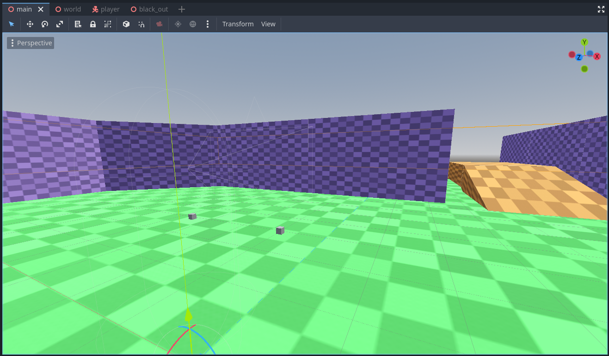

# Godot 4 OpenXR demo project

This demo project is a combination of various smaller demos that are part of the godot-demo-projects repo showing how to use various elements together.

Made for Godot 4.3 onwards

## Running on PCVR

This project can be run as normal for PCVR. Ensure that an OpenXR runtime has been installed.
This project has been tested with the Oculus client and SteamVR OpenXR runtimes.
Note that Godot currently can't run using the WMR OpenXR runtime. Install SteamVR with WMR support.

## Running on standalone VR

This project is preconfigured for export to Quest and Pico however you must install the Android build templates. The OpenXR vendors plugin is already included.
Please follow [the instructions for deploying on Android in the manual](https://docs.godotengine.org/en/stable/tutorials/xr/deploying_to_android.html).

## Screenshots

